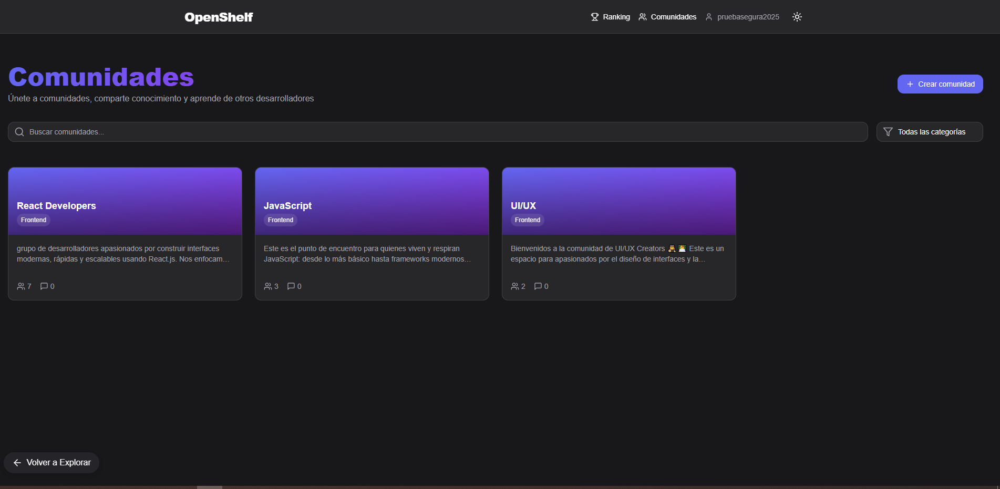
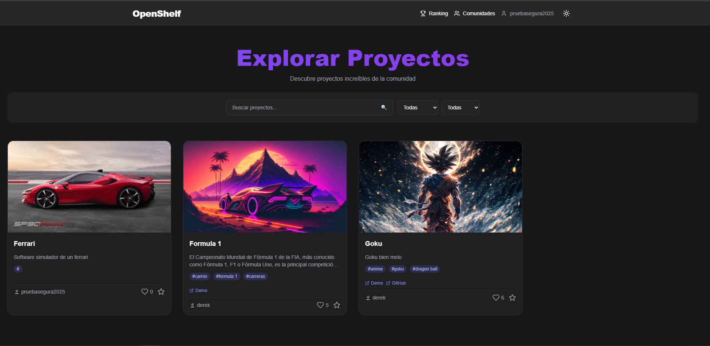
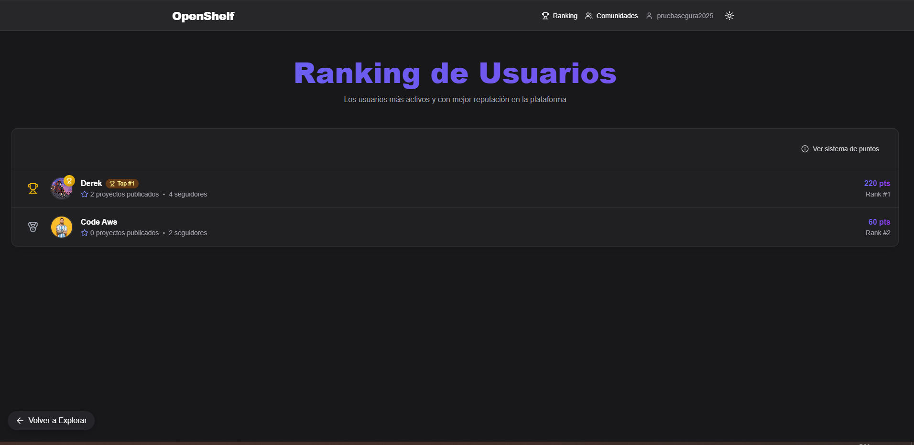
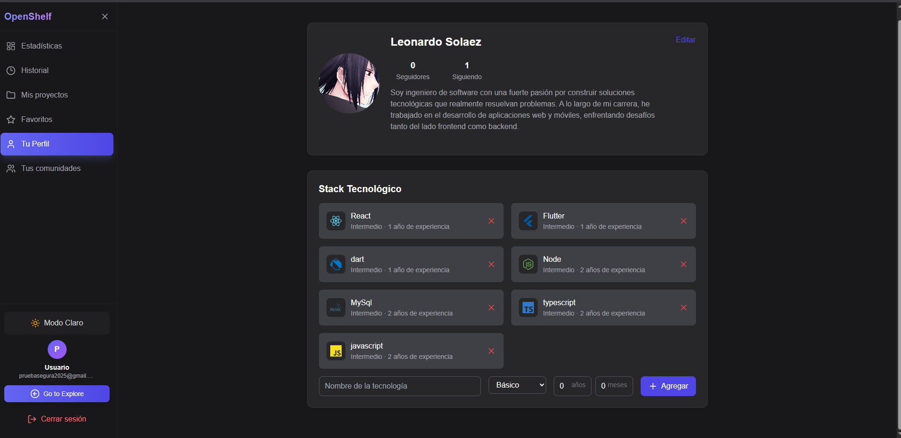
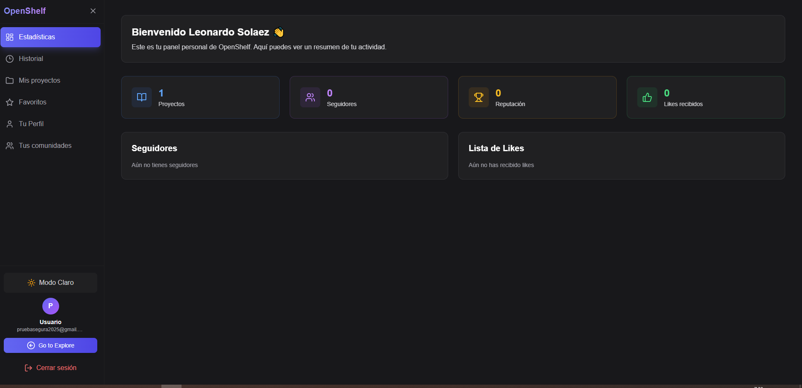
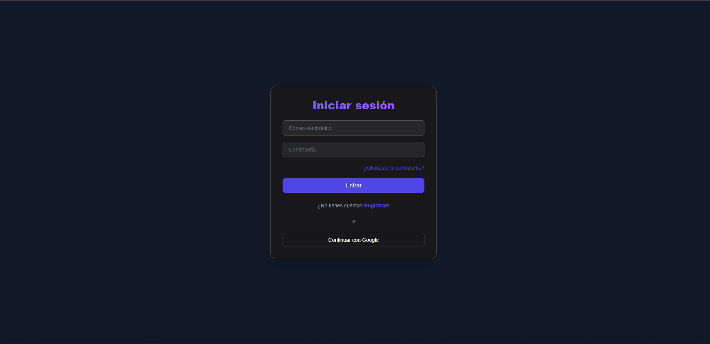

# Mi OpenLab

Mi OpenLab es una plataforma web moderna para la gestión y colaboración en comunidades de innovación y desarrollo.

## 🚀 Características

- Sistema de autenticación completo
- Gestión de comunidades
- Perfiles de usuario personalizables
- Sistema de rankings
- Panel de administración
- Exploración de proyectos y comunidades

## 🛠️ Tecnologías Utilizadas

-  React + TypeScript 
-  Vite
-  Tailwind CSS
-  Firebase (Authentication, Firestore, Storage)
-  React Router
- Context API para gestión de estado


## 📋 Prerrequisitos

- Node.js (versión 18 o superior)
- npm o yarn
- Cuenta de Firebase

## 🔧 Instalación

1. Clona el repositorio:
```bash
git clone [URL_DEL_REPOSITORIO]
cd mi-openlab
```

2. Instala las dependencias:
```bash
npm install
```

3. Configura las variables de entorno:
Crea un archivo `.env` en la raíz del proyecto con las siguientes variables:
```
VITE_FIREBASE_API_KEY=tu_api_key
VITE_FIREBASE_AUTH_DOMAIN=tu_auth_domain
VITE_FIREBASE_PROJECT_ID=tu_project_id
VITE_FIREBASE_STORAGE_BUCKET=tu_storage_bucket
VITE_FIREBASE_MESSAGING_SENDER_ID=tu_messaging_sender_id
VITE_FIREBASE_APP_ID=tu_app_id
```

4. Inicia el servidor de desarrollo:
```bash
npm run dev
```

## 🏗️ Estructura del Proyecto

```
mi-openlab/
├── src/
│   ├── components/     # Componentes reutilizables
│   ├── pages/         # Vistas principales
│   ├── context/       # Contextos de React
│   ├── hooks/         # Custom hooks
│   ├── services/      # Servicios y APIs
│   ├── utils/         # Utilidades
│   ├── types/         # Definiciones de TypeScript
│   └── assets/        # Recursos estáticos
```

## 📱 Vistas Principales

### 🏠 Home


La página principal muestra un resumen de las comunidades más activas y proyectos destacados.

### 👥 Comunidades


Explora y únete a diferentes comunidades de innovación. Crea nuevas comunidades y gestiona las existentes.

### 🔍 Explorar


Descubre nuevos proyectos, comunidades y usuarios en la plataforma.

### 🏆 Ranking


Visualiza los rankings de usuarios y comunidades más activas.

### 👤 Perfil de Usuario



Gestiona tu perfil, proyectos y participación en comunidades.

### 🔐 Autenticación


Sistema completo de autenticación con registro, inicio de sesión y recuperación de contraseña.


Herramientas de administración para gestionar usuarios, comunidades y contenido.

## 🔒 Seguridad

El proyecto implementa reglas de seguridad en Firestore y Storage para proteger los datos de los usuarios.

## 🤝 Contribución

1. Haz un Fork del proyecto
2. Crea una rama para tu feature (`git checkout -b feature/AmazingFeature`)
3. Commit tus cambios (`git commit -m 'Add some AmazingFeature'`)
4. Push a la rama (`git push origin feature/AmazingFeature`)
5. Abre un Pull Request


## 📞 Contacto

derekp@uninorte.edu.co
lsolaez@uninorte.edu.co
hsuarez@uninorte.edu.co
